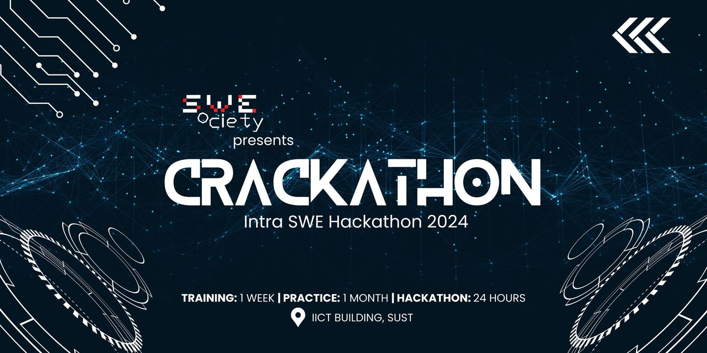

  
# 👨‍💻 Crackathon Bootcamp 👨‍💻

------ **📚 Intra SWE Hackathon 2024 - SWE Society 📚** ------

## 🚀 Phase One: Training (Duration: 1 Week)

- Date: Mar 8, 2024
- Location: Both IICT, SUST & Online

Overview: Join us for a week of targeted training sessions led by experienced graduates and current students of our SWE department. Gain essential knowledge and skills in JS, CSS & HTML layout designing, API integration, backend development, and React JS. Learn the secret sauce to win a hackathon! Equip yourself with the foundational skills needed for the upcoming hackathon.

| **Days** |  **Topic Covered**   |     **Instructor**     |                            **Resource**                             |
| :------: | :------------------: | :--------------------: | :-----------------------------------------------------------------: |
| Day - 1  |   Hackathon Basic    | Sumonta, Meheraj, Nafi |  **( [👉 Click Here](./Day%20-%201%20-%20Hackathon%20Basics/) )**   |
| Day - 2  |     CSS Styling      |        Meheraj         |     **( [👉 Click Here](./Day%20-%204%20-%20CSS%20Styling/) )**     |
| Day - 3  |   Javascript Basic   |         Shawon         |  **( [👉 Click Here](./Day%20-%202%20-%20Javascript%20Basics/) )**  |
| Day - 4  |  Javascript Advance  |         Shawon         | **( [👉 Click Here](./Day%20-%203%20-%20Javascript%20Advance/) )**  |
| Day - 5  |       React JS       |        Sumonta         |      **( [👉 Click Here](./Day%20-%205%20-%20React%20JS//) )**      |
| Day - 6  | Backend + Express JS |           ?            | **( [👉 Click Here](./Day%20-%206%20-%20Backend%20+%20Express/) )** |
| Day - 7  |     API + Axios      |           ?            |    **( [👉 Click Here](./Day%20-%207%20-%20API%20+%20Axios/) )**    |

## 💻 Phase Two: Practice (Duration: 4 Weeks)

- Date: Will be announced soon
- Location: Online
  Overview: Engage in practical exercises and hands-on projects to apply the concepts learned in the training phase. Collaborate on group projects, receive regular mentorship support, and participate in code reviews for constructive feedback. Build confidence, reinforce your training, and hone your problem-solving abilities during this crucial phase.

## 🏆 Phase Three: Hackathon (Duration: 24 Hours)

- Date: Will be announced soon
- Location: IICT, SUST
  Overview: The grand finale! Put your skills to the test in a 24-hour hackathon featuring real-world challenges. Teams formed during the practice phase will collaborate to devise innovative solutions, showcase creativity, and demonstrate technical skills. Join us for a platform of healthy competition, knowledge exchange, networking, and cross-functional collaboration. Celebrate the skills and expertise of our SWE department!

## 📅 Important Dates:

- Phase One: Training - Mar 8, 2024 to Mar 14, 2024
- Phase Two: Practice - starting: March 15, 2024
- Ending: Will be announced soon
- Phase Three: Hackathon - Will be announced soon

